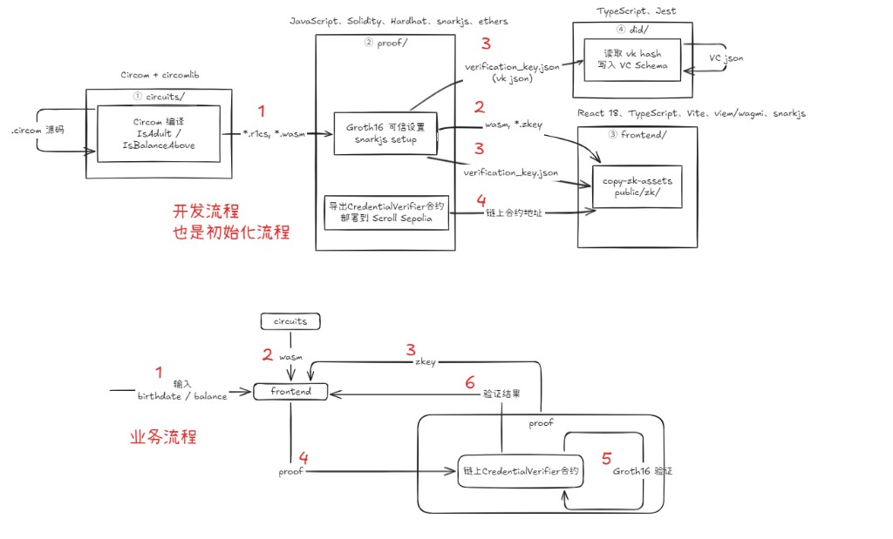
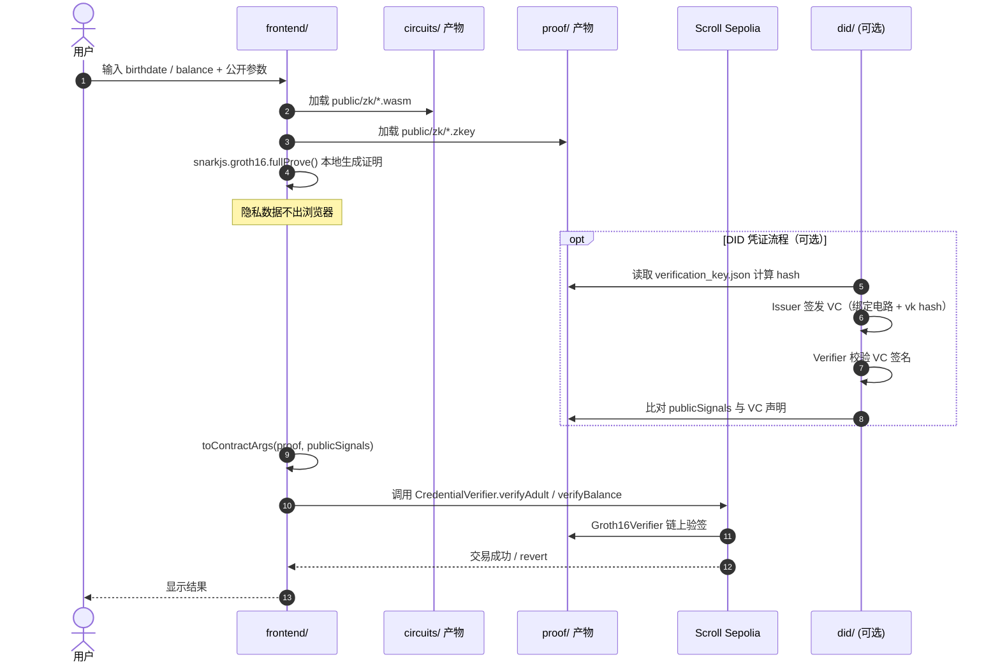

# 详细设计文档：L2 身份与隐私凭证系统

## 总体架构



> 上图：**开发流程**（初始化，`npm run setup` + 部署）与 **业务流程**（用户操作 DApp）的模块划分与数据流向。交互方式清单见下文「模块间交互方式」。

项目分为四个独立模块。模块间存在两类依赖：

- **构建时依赖**（一次性）：上游产出文件，下游读取
- **运行时依赖**（用户操作时）：前端/DID 在业务过程中调用上游产物

### 构建时流水线（`npm run setup`）

```
┌──────────────────┐
│  ① circuits/     │  Circom 编译
│  IsAdult         │  ──产出──▶  *.r1cs, *.wasm
│  IsBalanceAbove  │
└────────┬─────────┘
         │ ② 读取 r1cs + wasm
         ▼
┌──────────────────┐
│  ③ proof/        │  Groth16 可信设置 (snarkjs)
│  setup.js        │  ──产出──▶  *.zkey, verification_key.json
│                  │            IsAdultVerifier.sol
│                  │            IsBalanceAboveVerifier.sol
│                  │            CredentialVerifier.sol
└────────┬─────────┘
         │ ④ 复制 wasm + zkey          │ ⑤ 读取 vk hash（可选）
         ▼                               ▼
┌──────────────────┐            ┌──────────────────┐
│  ⑥ frontend/     │            │  did/            │
│  public/zk/      │            │  签发 VC 时绑定   │
│  (浏览器证明资源)  │            │  电路 vk hash    │
└──────────────────┘            └──────────────────┘
```

| 步骤 | 执行方 | 使用的上游 | 产出 |
|------|--------|-----------|------|
| ① | `circuits/` | circomlib | `build/*/is_*_main.r1cs`, `*.wasm` |
| ②③ | `proof/scripts/setup.js` | ① 的 r1cs + wasm | `keys/*_final.zkey`, `keys/*_verification_key.json`, `contracts/*.sol` |
| ④ | `frontend/scripts/copy-zk-assets.sh` | ① 的 wasm，③ 的 zkey | `frontend/public/zk/` |
| ⑤ | `did/src/core.ts` | ③ 的 `verification_key.json` | VC 中的 `verificationKeyHash` 字段 |
| ⑥ | `proof/scripts/deploy.js` | ③ 的 Solidity 合约 | 链上 `CredentialVerifier` 地址 |

### 运行时业务流程（用户操作 DApp）



| 步骤 | 执行模块 | 调用的功能 / 产物 | 说明 |
|------|----------|-------------------|------|
| 1 | `frontend/` | — | 用户输入私有 + 公开信号 |
| 2 | `frontend/` → `circuits/` | `*.wasm` | witness 计算逻辑 |
| 3 | `frontend/` → `proof/` | `*_final.zkey` | Groth16 证明密钥 |
| 4 | `frontend/` | snarkjs | 在浏览器本地生成 `{ proof, publicSignals }` |
| 5 | `did/` → `proof/` | `verification_key.json`, `public.json` | **可选**：VC 绑定电路，验证 publicSignals |
| 6 | `frontend/` | `toContractArgs()` | 将 proof 转为 Solidity 参数格式 |
| 7 | `frontend/` → `proof/` | `CredentialVerifier` ABI + 部署地址 | viem 发交易 |
| 8 | 链上合约 | `IsAdultVerifier` / `IsBalanceAboveVerifier` | Groth16 验证，emit 事件 |

### 模块间依赖一览

```
circuits/          proof/              did/                 frontend/
─────────          ──────              ────                 ────────
IsAdult.circom ──▶ setup.js 读 r1cs
IsBalanceAbove ──▶ generateProof.js 读 wasm ──▶ loadVkHash ──▶ copy-zk-assets
                   export verifier.sol ──────────────────────▶ deploy 地址 + ABI
                   examples/proof.json ──▶ validateZkBinding
```

> **最简路径**（跳过 DID）：构建依赖为 `circuits → proof → frontend`；**业务起点**是 `frontend`（用户输入 → 本地证明 → 链上验证）。

### 模块间交互方式

#### 开发 / 初始化阶段

| 源 → 目标 | 交互方式 | 传什么 |
|-----------|----------|--------|
| `circuits` → `proof` | 文件读 + 子进程 | `*.r1cs`, `*.wasm` |
| `proof` → `proof` | 文件读/写 + snarkjs CLI | zkey, vk JSON, Verifier `.sol` |
| `circuits` + `proof` → `frontend` | 文件拷贝 | wasm, zkey → `frontend/public/zk/` |
| `proof` → 链 | 区块链 RPC | 部署 `CredentialVerifier` 等合约 |
| `proof` → `frontend` | 环境变量 + 手写 ABI | 合约地址 → `.env`；函数签名 → `abi.ts` |
| `proof` → `did` | 文件读 | `*_verification_key.json`（算 vk hash） |

#### 业务运行阶段

| 源 → 目标 | 交互方式 | 传什么 |
|-----------|----------|--------|
| 用户 → `frontend` | UI 输入 | birthdate / balance 等 |
| `frontend` → 静态资源 | HTTP 加载 | `/zk/*.wasm`, `/zk/*.zkey` |
| `frontend` → `frontend` | 浏览器本地计算 | snarkjs 生成 `{ proof, publicSignals }` |
| `frontend` → 链上合约 | 区块链 RPC | `verifyAdult` / `verifyBalance` calldata |
| `did` | — | MVP 未接入 frontend 主流程 |

## 模块 1：ZK 电路 (zk-circuit)

**职责**：用 Circom 编写核心逻辑电路，编译并输出约束文件（r1cs）与 Wasm 计算文件。

**功能点**：

- IsAdult 电路：输入生日（私有），输出成年布尔值。
- IsBalanceAbove 电路：输入余额（私有）、阈值（公开），输出比较结果。
- 电路测试用例（输入/输出验证）。

**依赖**：Circom 编译器，circomlib（可能）。

**待确认问题**：

- 阈值是否作为公开输入？成年判定是否依赖当前时间戳（公开输入）？
- 余额电路是否只需大于阈值，还是需要范围证明？

## 模块 2：证明生成与链上验证 (proof-verification)

**职责**：

- 执行 Groth16 可信设置（Powers of Tau + 电路特定阶段）。
- 生成证明密钥（proving key）和验证密钥（verification key）。
- 用 Node.js 脚本生成证明，并导出 calldata。
- 编写 Solidity 验证合约，在 Remix VM 中验证证明。
- 链上验证单元测试。

**输出**：合约 ABI，验证密钥哈希，测试通过的证明示例。

**待确认问题**：

- 可信设置阶段是否需要分阶段执行，还是使用 snarkjs 全流程自动化？测试中使用预生成还是 mock？
- 验证合约是否需要存储验证密钥，还是直接硬编码？

## 模块 3：DID 集成 (did-integration)

**职责**：

- 基于 Polygon ID（Iden3）创建 DID 标识。
- 签发可验证凭证（VC），其条件与 ZK 电路关联（例如 VC 中声明 “age >= 18”，proof 类型为 BJJ 签名或基于 ZK 的凭证）。
- 使用 Polygon ID Wallet 或 SDK 验证 VC 与 ZK 证明的关联。

**待确认问题**：

- 是否使用 Polygon ID 的 on-chain 验证模式还是 off-chain 验证？
- DID 的存储位置（链上/链下/IPFS）？
- 是否允许用户在没有完整 DID 交互的情况下直接使用原始 ZK 证明（即模块 3 为可选）？

## 模块 4：L2 DApp 交互 (l2-dapp)

**职责**：

- 将验证合约部署至 Scroll/Polygon zkEVM 测试网。
- 实现前端界面：连接钱包（MetaMask）、生成证明（调用模块 2 脚本或 WASM）、提交证明至合约、显示交易结果。
- 前端与 DID 钱包交互（可选，展示 VC）。

**技术选择**：React + ethers.js / viem。合约交互需 ABI。

**待确认问题**：

- 前端是单页应用还是多页面？是否需要托管 IPFS？
- 证明生成在前端运行还是通过后端服务？若在前端运行，需加载 snarkjs 的浏览器版。

## 数据流（已确认实现）

构建阶段见上文「构建时流水线」①–⑥；用户操作阶段见「运行时业务流程」①–⑧。

核心原则：**隐私输入只在 `frontend/` 浏览器内处理**，经 `circuits/` 的 wasm 计算 witness，用 `proof/` 的 zkey 生成证明，最终由 `proof/` 部署的合约在 Scroll Sepolia 验证。

## 接口定义

- 电路接口：输入信号格式，输出信号格式。
- 证明生成脚本 API：输入（电路文件、密钥、输入数据），输出（proof, publicSignals）。
- 验证合约接口：`verifyProof(uint[2] memory a, uint[2][2] memory b, uint[2] memory c, uint[1] memory input) public returns (bool)`（Groth16 标准）。
